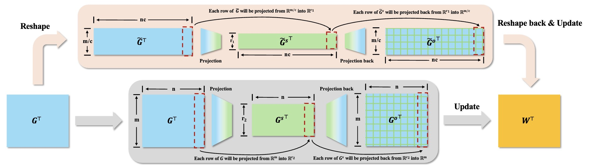
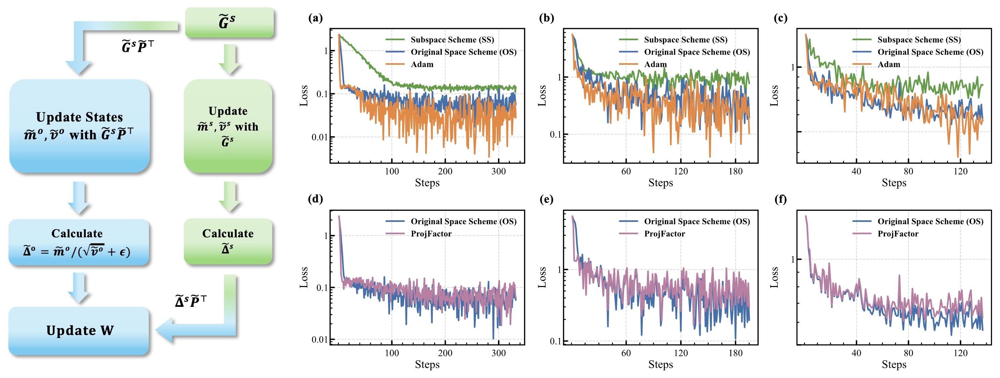
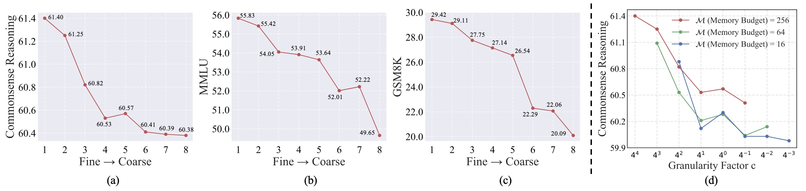

# VLoRP: Various‑Grained Low‑Rank Gradient Projection

A lightweight, memory‑efficient fine‑tuning toolkit that projects gradients into a low‑dimensional subspace at **adjustable granularity** and updates with an Adam‑like optimizer **ProjFactor**.

> **What’s new?** VLoRP adds a *projection granularity* hyperparameter `c` in addition to the usual rank `r`, letting you trade memory ↔ performance under a fixed budget $\mathcal{M} = c·r$. Finer granularity (larger `c`, smaller `r`) consistently yields stronger results at the same memory cost, and the method introduces **no extra compute** beyond a pair of reshape ops.  
---

## Highlights

- **Memory‑efficient:** stores projected gradients; total memory $O(mn + 2ncr + n + m)$. In experiments, VLoRP used ~**24.1GB** vs LoRA **28.8GB** (budget 256). 
- **Strong accuracy at fixed budget:** the finest‑grained setting $c=256, r=1$ is consistently among the best under $M=256$. 
- **Projection choices:** Gaussian (normal), Rademacher, or SVD bases all work similarly; normal is slightly better after convergence. 

---

## Key Ideas

- **Gradient projection with granularity.** Reshape each parameter’s gradient matrix $G ∈ ℝ^{n×m}$ to $\tilde G ∈ ℝ^{nc×(m/c)}$, project rows with a random matrix $\tilde P ∈ ℝ^{(m/c)×r}$, store $\tilde G_s=\tilde G\tilde P$, then project‑back and reshape for the update. Only reshapes are added; compute overhead is unchanged. 
- **Two update schemes, OS > SS.** Original‑space (OS) adapts in the full space and tracks Adam closely; subspace (SS) adapts inside the subspace and converges slower when the second moment is used. We propose **ProjFactor** to approximate OS with far lower memory.  
- **Budgeting and performance.** Define memory budget $M=c·r$. Under the same $M$, finer granularity generally performs better and can even reduce FLOPs and numeric error.   
- **Convergence.** With SGD, VLoRP attains the standard $O(1/T)$ rate; with ProjFactor, a Lyapunov (Hamiltonian) argument shows monotone energy decrease toward a stationary point. 
---

## Quick Start

> Below are **minimal templates**.

### A) CLI
```bash
CUDA_VISIBLE_DEVICES=0 torchrun --standalone --nproc_per_node 1 torchrun_main.py  \
    --model_name llama-2-7b \
    --dataset commonsense \
    --lr 2e-5 \
    --activation_checkpointing   \
    --batch_size 16   \
    --total_batch_size 512 \
    --num_training_steps 138 \
    --warmup_steps 0 \
    --weight_decay 0  \
    --grad_clipping 1.0 \
    --dtype bfloat16   \
    --eval_every 100 \
    --update_proj_gap 30 \
    --scale 0.25 \
    --factor 256 --rank 1  \
    --single_gpu \
    --optimizer projfactor \
    --max_length 1024 \
    --wandb_expname  llama2-7b-commonsense-VLoRP-c256-r1 
```

### B) Python (library‑style)
```python
from transformers import Trainer
from vlorp.optim import ProjFactor

args = ...

optimizer = ProjFactor( 
            model,
            lr=args.lr,
            weight_decay=args.weight_decay,
            rank=args.rank,
            update_proj_gap=args.update_proj_gap,
            scale=args.scale,
            factor=args.factor,
            scheduler=args.scheduler,
            gradient_accumulation=args.gradient_accumulation,
            warmup_steps=args.warmup_steps,
            num_training_steps=args.num_training_steps,
            min_lr_ratio=args.min_lr_ratio,
            correct_bias=True,
            proj_matrix_dist=args.proj_matrix_dist,
        )
scheduler = ...
# ... set up dataloaders and model, then follow standard training loop ...
trainer = Trainer(
  ...,
  optimizers=(optimizer, scheduler)
)

```

> Tip: Start with **fine granularity** (large `c`, small `r`) for a stronger baseline under the same `budget`. 

---

## General Framework

|  |
|:--|
| **Figure 1.** Overview of VLoRP versus standard LoRP. *Bottom (gray)* : In ordinary LoRP, the gradient matrix $G$ is directly projected row‐by‐row from $\mathbb{R}^{n\times m}$ into $\mathbb{R}^{n\times r}$ and stored as $G^{s}$. *Top (pale beige)*: In contrast, VLoRP reshapes the original gradient matrix $G$ first to adjust the granularity of projection (from $\mathbb{R}^{n\times m}$ to $\mathbb{R}^{nc \times\frac{m}{c}}$), and during the update, the project-backed gradient $\tilde{G}^o$ would be reshaped back into $\mathbb{R}^{n\times m}$ to update the parameter $W\in \mathbb{R}^{n\times m}$. |

---

## Optimization

|  |
|:--|
| **Figure 2.** **Left:** Schematic illustration of the Subspace Scheme (SS, green) operating in a learned subspace, and the Original Scheme (OS, blue) operating in the original space. **Right (top row, panels a--c):** Fine-tuning loss curves of SS (green), OS (blue), and Adam (orange) on three tasks, showing that OS outperforms SS by a large margin while having a comparable performance with Adam. **Right (bottom row, panels d--f):** Comparison of OS (blue) and its approximate algorithm ProjFactor (purple), indicating that ProjFactor closely approximates the dynamics of OS. Specifically, columns (a) and (d) test on the Commonsense Reasoning task, columns (b) and (e) test on the MMLU, and columns (c) and (f) test on the GSM8K. |

---

## Configuration

- c (granularity factor): number of vertical slices per gradient row (power‑of‑two recommended). Larger `c` ⇒ finer granularity.
- r (rank): subspace dimension per slice.
- $\mathcal{M}$ (memory budget): product `c*r`; in our paper, we compare settings under the same $\mathcal{M}$.
- proj_type: `normal` | `rademacher` | `svd` (all viable). 
- optimizer: `projfactor` (Adam‑like, memory‑saving). 
---

> Notes: exact hyperparameters, warmup steps, and projection refresh frequency are discussed in the paper’s appendix figures/tables.

---

## Why Fine Granularity?

Under a fixed budget `M`, finer granularity reduces FLOPs (by a factor proportional to `1/c`) and improves numeric stability—useful for bf16/fp16 and long accumulations.  

|  |
|:--|
| **Figure 3.** (a-c). Performance comparison of VLoRP configurations under a fixed memory budget $\mathcal{M}=256$. The y-axis shows accuracy, whereas the x-axis indexes the projection‑granularity level. Level ``1'' denotes the finest grain, $(c=256, r=1)$. Each unit increase in level divides $c$ by 4 and multiplies $r$ by 4; (d). Performance Evaluation for Different Projection Granularities under Varying Memory Budgets on Commonsense.. |

---
## Convergence Guarantee

> **Please refer to table 4 for the meaning of notations in our paper.**

### Convergence Guarantee under SGD

Consider a loss function $\mathcal{L}: \mathbb{R}^{n \times m} \to \mathbb{R}$ defined over matrix parameters $W \in \mathbb{R}^{n \times m}$. Fix a memory budget $\mathcal{M}$, a granularity factor $c$, rank $r$, and $G = \nabla_{W} \mathcal{L}(W)$, we have

**Theorem 1.** Let $\mathcal{L}$ be an $L$-smooth function with respect to the matrix-shaped parameter $W$.
Assume the parameter updates are given by $W_{t+1} = W_t - \eta  G_t^o$, where the step size is defined as $\eta = \tfrac{\mathcal{M}}{(m + c + \mathcal{M})L} := C$.
Then, for any $T \geq 1$:

$$\frac{1}{T} \sum_{t=0}^{T-1} \mathbb{E}\bigl[\|G_t\|^2\bigr] \leq \frac{2C}{T}\bigl(\mathcal{L}(W_0) - \mathcal{L}(W^*)\bigr),$$

where $W^*$ is a global minimizer of $\mathcal{L}$.

Theorem 1 confirms that using random projection-based gradient estimation with VLoRP in conjunction with SGD achieves an $O(1/T)$ convergence rate, regardless of the granularity factor $c$. 

### Convergence Guarantee under Proposed Adam-like Memory-Efficient Optimizer ProjFactor

To analyze the convergence properties of ProjFactor, we leverage the Hamiltonian descent framework, a powerful tool for understanding the behavior of optimizers in continuous time. This framework allows us to model ProjFactor’s update rule as an ordinary differential equation (ODE), providing insights into its long-term stability and convergence.

The infinitesimal updates of Projfactor is defined as follows:

$$\frac{d}{dt}\tilde m_t^{s}=a\left(\tilde G_t^{s}-\tilde m_t^{s}\right), \qquad \hat v_t^{o}=\frac{\tilde v_{rt}^{o} \tilde v_{ct}^{o}}{\mathbf{1}_n^{\top}\tilde v_{rt}^{o}};$$
$$\frac{d}{dt}\tilde v_{rt}^{o} = b\left((\tilde G_t^{o})^{\odot 2} \mathbf{1}_m - \tilde v_{rt}^{o}\right);$$
$$\frac{d}{dt}\tilde v_{ct}^{o} = b\left(\mathbf{1}_n^{\top}(\tilde G_t^{o})^{\odot 2} - \tilde v_{ct}^{o}\right);$$
$$\frac{d}{dt}W_t = Reshape\left(-\tilde m_t^{s}\tilde P^{\top}/\sqrt{\hat v_t^{o}}, [n,m]\right).$$

We use `*` to denote the above update system.

*Notes:* $\odot$ = elementwise product, $(\cdot)^{\odot 2}$ = elementwise square; $\mathbf{1}_n,\mathbf{1}_m$ are all-ones vectors of lengths $n,m$.


The corresponding Lyapunov function (Hamiltonian) is defined as 

$$\mathcal{H}(W,\tilde{m}^s,\tilde{v}^o_{r},\tilde{v}^o_c) = \mathcal{L}(W)+ \frac{1}{2a}\left\langle \tilde{m}^s, \frac{\tilde{m}^s}{\sqrt{\hat{v}^o}}\right\rangle.$$

Subsequently, we make the following mild assumptions, consistent with prior works in this area, to establish the mathematical foundation for our analysis. 

**Assumption**  Assume the functions in system \eqref{eq:projfactor_infinitesimal_appendix} are continuously differentiable, and following conditions hold
1. $\frac{d}{dt} \mathcal{H} (W_t , \tilde{m}_t^s , \tilde{v}^{o}_{rt} , \tilde{v}^{o}_{ct} ) = 0$ implies $\tilde{G}^s_t=0$.
2. For any $t>0$, if $G_t\neq 0$, then $\tilde{G}_t^s \neq 0$ and $\tilde{G}_t^o \neq 0$. 
3. For any $t>0$, $\frac{|\tilde{G}_t^o|^2}{|\tilde{v}^o_{rt}|}\leq R$.

**Theorem 2.** Suppose the functions in system `*` are continuously differentiable. Under above **Assumption** we have:

1. For $(W_t, \tilde{m}_t^{s}, \tilde{v}_{rt}^{o}, \tilde{v}_{ct}^{o})$ satisfying `*`, 

$$\frac{d}{dt} \mathcal{H}\left(W_t, \tilde{m}_t^{s}, \tilde{v}_{rt}^{o}, \tilde{v}_{ct}^{o}\right) \le 0$$

2. Any bounded solution $\bigl(W_t, \tilde{m}_t^{s}, \tilde{v}_{rt}^{o}, \tilde{v}_{ct}^{o}\bigr)_t$ of `*` converges to a stationary point of $\mathcal{L}(W)$ as $t\to\infty$.

---

## Citation

If you use this repo, please cite the paper:

```
@article{vlorp,
  title={Memory-Efficient LLM Training by Various-Grained Low-Rank Projection of Gradients},
  author={Yezhen Wang, Zhouhao Yang, Brian K Chen, Fanyi Pu, Bo Li, Tianyu Gao, Kenji Kawaguchi},
  journal={arXiv preprint arXiv:2505.01744},
  year={2025}
}
```